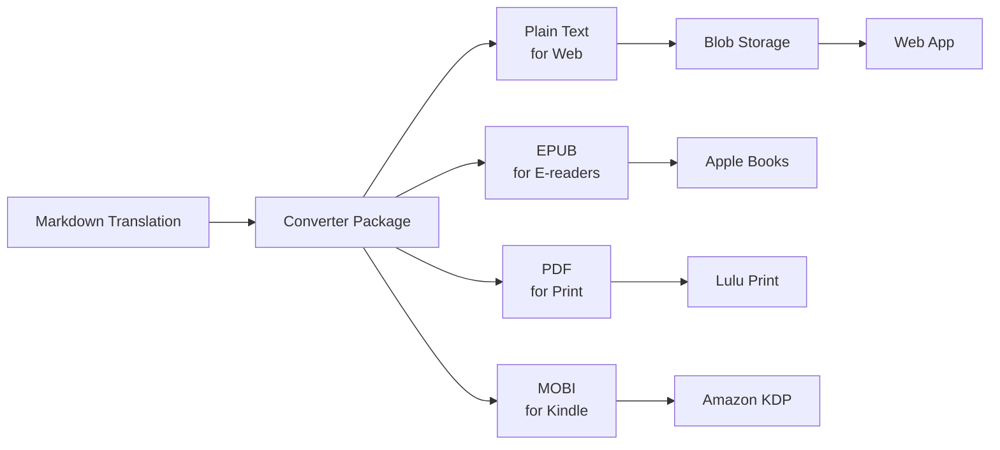

# 📚 Brainrot Publishing House - Monorepo

> *Making classic literature absolutely bussin' for Gen Z, no cap fr fr*

## 🚀 What Is This?

Brainrot Publishing House creates hilarious Gen Z "brainrot" translations of classic literature. We're talking Shakespeare but make it TikTok. Fitzgerald but make it Discord. Homer but make it Twitch chat.

This monorepo contains:
- **Web App**: Next.js reading platform at [brainrot.pub](https://brainrot.pub) (eventually)
- **Translations**: The actual book translations (our crown jewels)
- **Publisher**: Automated publishing to Amazon KDP, Lulu, and more
- **Converter**: Tools to transform content for different platforms

## 🏗️ Architecture

```
brainrot/
├── apps/
│   ├── web/                 # Next.js web application
│   ├── publisher/           # CLI for publishing to platforms
│   └── studio/             # (Future) Translation editor
├── content/
│   └── translations/       # Book translations and metadata
├── packages/
│   ├── @brainrot/converter/    # MD→TXT/EPUB/PDF conversion
│   ├── @brainrot/templates/    # Document templates
│   ├── @brainrot/types/        # Shared TypeScript types
│   └── @brainrot/blob-client/  # Storage utilities
└── scripts/                    # Automation scripts
```

## 🚦 Quick Start

```bash
# Install dependencies
pnpm install

# Start development
pnpm dev

# Build everything
pnpm build

# Run tests
pnpm test
```

## 📖 Available Books

### Currently Published
- The Iliad - *"greek drama hits different when paris catches feelings"*
- The Odyssey - *"odysseus speed-running his way home while poseidon stays pressed"*
- The Great Gatsby - *"old sport gets cooked by capitalism, green light hits different"*

### Coming Soon
- Pride and Prejudice
- Hamlet  
- Romeo and Juliet
- Frankenstein
- Alice in Wonderland
- And 100+ more classics

## 🔧 Development

### Prerequisites
- Node.js >= 22.0.0
- pnpm >= 8.15.1
- Git with subtree support

### Commands

```bash
# Web app only
pnpm dev:web
pnpm build:web

# Generate book formats
pnpm generate:formats great-gatsby

# Sync to blob storage
pnpm sync:blob great-gatsby

# Publish to all platforms
pnpm publish:all great-gatsby

# Add new translation
pnpm new:translation "book-name"
```

### Environment Variables

Copy `.env.example` to `.env.local` and fill in:
- `BLOB_READ_WRITE_TOKEN` - Vercel blob storage
- `LULU_API_KEY` - For print publishing
- `KDP_EMAIL/PASSWORD` - For Amazon publishing

## 📚 Content Pipeline



## 🎯 Publishing Targets

- **Web**: Vercel + Blob Storage (automatic)
- **Amazon KDP**: Kindle + Paperback (semi-automated)
- **Lulu**: Print-on-demand (API automated)
- **IngramSpark**: Bookstores (manual)
- **Apple Books**: Coming soon
- **Google Play**: Coming soon

## 🏛️ Project Philosophy

We believe classic literature should be:
1. **Accessible** - No more "thou" and "forsooth"
2. **Entertaining** - Actual laugh-out-loud moments
3. **Relevant** - References that make sense today
4. **Respectful** - The stories remain intact
5. **Educational** - Still learning, just more fun

## 🤝 Contributing

This is currently a private project, but we're considering open-sourcing the translation tools. Stay tuned!

## 📄 License

The translations are original creative works. Classic source texts are public domain. 

## 🔗 Links

- **Web App**: [brainrot.pub](https://brainrot.pub) (coming soon)
- **GitHub**: [github.com/phrazzld/brainrot](https://github.com/phrazzld/brainrot)
- **Discord**: Coming soon
- **TikTok**: @brainrotpublishing (coming soon)

## 🚧 Migration Status

This monorepo is being migrated from two separate repositories:
1. `brainrot-publishing-house` (web app)
2. `brainrot-translations` (content)

See [MIGRATION_CONTEXT.md](./MIGRATION_CONTEXT.md) for details.

## 🆘 Troubleshooting

### Great Gatsby not loading?
The text files need to be converted and uploaded to blob storage. Run:
```bash
pnpm generate:formats great-gatsby
pnpm sync:blob great-gatsby
```

### Build failing?
Make sure you have:
- Node.js >= 22.0.0
- pnpm >= 8.15.1
- All environment variables set

### Git history missing?
We use subtree merge to preserve history. If you need to trace back:
```bash
git log --follow apps/web/[file]
git log --follow content/translations/[file]
```

## 📈 Roadmap

### Phase 1: Migration (Current)
- [x] Create monorepo structure
- [ ] Migrate repositories
- [ ] Set up packages
- [ ] Fix Great Gatsby

### Phase 2: Publishing Pipeline
- [ ] Lulu API integration
- [ ] KDP automation
- [ ] Batch processing

### Phase 3: Scale
- [ ] 50 books translated
- [ ] Subscription service
- [ ] Mobile apps
- [ ] AI translation assistance

### Phase 4: Empire
- [ ] 500+ books
- [ ] International versions
- [ ] Educational partnerships
- [ ] Physical bookstore presence

---

*"We're not just translating books, we're translating culture. Shakespeare would've loved TikTok, and we're here to prove it."*

**The Brainrot Publishing House Team** 
*Making Literature Absolutely Bussin' Since 2024*