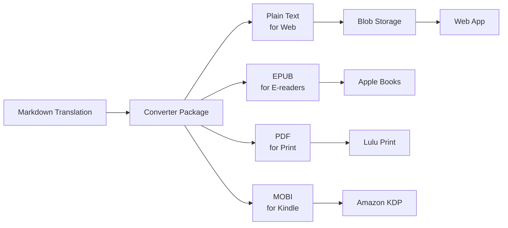

# 📚 Brainrot Publishing House - Monorepo

> *Making classic literature absolutely bussin' for Gen Z, no cap fr fr*

## 🚀 What Is This?

Brainrot Publishing House creates hilarious Gen Z "brainrot" translations of classic literature. We're talking Shakespeare but make it TikTok. Fitzgerald but make it Discord. Homer but make it Twitch chat.

This monorepo contains:
- **Web App**: Next.js reading platform at [brainrot.pub](https://brainrot.pub) (eventually)
- **Translations**: The actual book translations (our crown jewels)
- **Publisher**: Automated publishing to Amazon KDP, Lulu, and more
- **Converter**: Tools to transform content for different platforms

## 🏗️ Monorepo Architecture

```
brainrot/
├── apps/
│   ├── web/                    # Next.js 15 web application
│   └── publisher/              # CLI for KDP, Lulu, IngramSpark
├── content/
│   └── translations/
│       └── books/              # All book translations
│           ├── great-gatsby/   # Each book has brainrot/ and metadata.yaml
│           ├── the-iliad/
│           └── [8 more books]
├── packages/
│   ├── @brainrot/types/        # Shared TypeScript interfaces
│   ├── @brainrot/converter/    # Markdown → Text/EPUB/PDF/Kindle
│   ├── @brainrot/blob-client/  # Vercel Blob storage with retry logic
│   ├── @brainrot/metadata/     # YAML parsing, ISBN validation
│   └── @brainrot/templates/    # LaTeX/EPUB/Kindle templates
├── scripts/
│   ├── generate-formats.ts     # Convert books to all formats
│   └── sync-translations.ts    # Upload to blob storage
└── turbo.json                  # Turborepo configuration
```

## 🚦 Quick Start

### Prerequisites
```bash
# Required versions
node >= 22.0.0
pnpm >= 8.15.1

# Clone the monorepo
git clone https://github.com/phrazzld/brainrot.git
cd brainrot
```

### Get Started
```bash
# Install all dependencies
pnpm install

# Start everything in dev mode
pnpm dev

# Or just the web app
pnpm dev --filter=@brainrot/web

# Build everything (super fast with Turborepo!)
pnpm build

# Run tests
pnpm test
```

### Monorepo Benefits
- **⚡ Lightning fast builds** - Turborepo caches everything (174ms rebuilds!)
- **📦 Shared packages** - Reusable code across all apps
- **🔄 Unified pipeline** - One command to rule them all
- **🎯 Selective execution** - Work on just what you need
- **🔗 Type safety** - TypeScript types shared everywhere

## 📖 Available Books

### Currently Translated (8 books, 124 text files)
- **The Great Gatsby** - *"back when i was a lil sus beta and way more vulnerable to getting absolutely ratio'd by life"*
- **The Iliad** - *"greek drama hits different when paris catches feelings"*
- **The Odyssey** - *"odysseus speed-running his way home while poseidon stays pressed"*
- **The Aeneid** - *"aeneas carries his dad out of troy like a true sigma"*
- **Alice in Wonderland** - *"alice falls down the most unhinged discord server"*
- **Frankenstein** - *"victor creates life then ghosts harder than your crush"*
- **Declaration of Independence** - *"the colonies said 'we're breaking up with u britain'"*
- **Simple Sabotage Field Manual** - *"how to troll your workplace (CIA approved)"*

### In Progress
- **La Divina Comedia** - Complex 3-part structure needs special handling
- **Tao Te Ching** - Source text ready, translation pending

### Coming Soon
- Pride and Prejudice
- Hamlet
- Romeo and Juliet
- Paradise Lost
- And 100+ more classics

## 🔧 Development

### Tech Stack
- **Monorepo**: Turborepo + pnpm workspaces
- **Web**: Next.js 15 + React 19 + TypeScript
- **Styling**: Tailwind CSS + Radix UI
- **Storage**: Vercel Blob Storage
- **Publishing**: Playwright (KDP) + Axios (Lulu API)
- **Testing**: Jest + React Testing Library
- **CI/CD**: GitHub Actions + Vercel

### Commands

```bash
# Development
pnpm dev                        # Start all apps in dev mode
pnpm dev --filter=@brainrot/web # Web app only
pnpm build                      # Build everything (174ms with cache!)
pnpm test                       # Run all tests
pnpm lint                       # Lint all packages

# Content Pipeline
pnpm generate:formats [book]    # Convert markdown to all formats
pnpm generate:formats --all     # Process all books
pnpm sync:blob [book]          # Upload to Vercel Blob storage
pnpm sync:blob --all           # Sync all books

# Publishing
pnpm publisher list             # List available books
pnpm publisher validate [book]  # Pre-flight checks
pnpm publisher publish [book] --platform=lulu  # Publish to Lulu
pnpm publisher publish [book] --platform=kdp   # Publish to Amazon
pnpm publisher publish-all [book]              # All platforms

# Utilities
pnpm vault:pull                # Get latest secrets
pnpm monitor:api               # Check API usage
```

### Environment Variables

This project uses **dotenv-vault** for secure secret sharing:

```bash
# First time setup
pnpm vault:login       # Login to dotenv-vault
pnpm vault:pull        # Pull encrypted secrets

# Daily workflow
pnpm vault:pull        # Get latest secrets
pnpm vault:push        # Share your changes
```

Manual setup (if not using vault):
- Copy `.env.example` to `.env.local`
- Add `BLOB_READ_WRITE_TOKEN` - Vercel blob storage
- Add `LULU_API_KEY` - For print publishing  
- Add `KDP_EMAIL/PASSWORD` - For Amazon publishing

See `docs/DOTENV_VAULT_SETUP.md` for complete setup guide.

### 🔒 Security Setup

Protect your secrets with our multi-layer security:

```bash
# Install Git hooks for local secret scanning
./scripts/setup-git-hooks.sh

# (Optional) Install gitleaks for enhanced scanning
brew install gitleaks

# Run manual security scan
gitleaks detect --source . -v
```

**Security Features:**
- **Pre-commit hooks** - Prevents accidental secret commits
- **GitHub secret scanning** - Monitors pushed code
- **Custom patterns** - Detects service-specific tokens
- **Gitleaks integration** - Advanced local scanning

See `docs/SECRETS.md` for rotation procedures.

## 📚 Content Pipeline



## 🎯 Publishing Targets

- **Web**: Vercel + Blob Storage (automatic)
- **Amazon KDP**: Kindle + Paperback (semi-automated)
- **Lulu**: Print-on-demand (API automated)
- **IngramSpark**: Bookstores (manual)
- **Apple Books**: Coming soon
- **Google Play**: Coming soon

## 🏛️ Project Philosophy

We believe classic literature should be:
1. **Accessible** - No more "thou" and "forsooth"
2. **Entertaining** - Actual laugh-out-loud moments
3. **Relevant** - References that make sense today
4. **Respectful** - The stories remain intact
5. **Educational** - Still learning, just more fun

## 🤝 Contributing

This is currently a private project, but we're considering open-sourcing the translation tools. Stay tuned!

## 📄 License

The translations are original creative works. Classic source texts are public domain. 

## 🔗 Links

- **Web App**: [www.brainrotpublishing.com](https://www.brainrotpublishing.com)
- **GitHub**: [github.com/phrazzld/brainrot](https://github.com/phrazzld/brainrot)
- **Discord**: Coming soon
- **TikTok**: @brainrotpublishing (coming soon)

## ✅ Migration Complete

This monorepo was successfully migrated from two repositories with full git history preserved:
- ✅ `brainrot-publishing-house` → `apps/web/`
- ✅ `brainrot-translations` → `content/translations/`

**Old repositories have been archived with deprecation notices.**

## 🆘 Troubleshooting

### Common Issues

**Great Gatsby not loading?**
✅ This has been fixed! All books are pre-processed and uploaded.

**Vercel deployment failing?**
Make sure to configure the monorepo settings in Vercel dashboard:
- Root Directory: (leave empty)
- Build Command: `pnpm build --filter=@brainrot/web`
- Output Directory: `apps/web/.next`
See `docs/VERCEL_DEPLOYMENT.md` for complete deployment guide.

### Build failing?
Make sure you have:
- Node.js >= 22.0.0
- pnpm >= 8.15.1
- All environment variables set

### Git history missing?
We use subtree merge to preserve history. If you need to trace back:
```bash
git log --follow apps/web/[file]
git log --follow content/translations/[file]
```

## 📈 Roadmap

### Phase 1: Migration ✅ COMPLETE
- [x] Create monorepo structure with Turborepo
- [x] Migrate repositories with git subtree
- [x] Set up 5 shared packages
- [x] Fix Great Gatsby (blob simplification: 1000 lines → 37 lines)

### Phase 2: Publishing Pipeline ✅ COMPLETE
- [x] Lulu API integration with OAuth2
- [x] KDP automation with Playwright
- [x] Batch processing for all books
- [x] Mock mode for testing

### Phase 3: Production Launch (Current)
- [x] Deploy to production on Vercel ✅
- [ ] Test publishing pipeline with real credentials
- [ ] Launch first 10 books on all platforms
- [ ] Set up analytics and monitoring

### Phase 4: Scale
- [ ] 50 books translated
- [ ] AI-assisted translation tools
- [ ] Subscription service
- [ ] Mobile apps

### Phase 5: Empire
- [ ] 500+ books
- [ ] International versions
- [ ] Educational partnerships
- [ ] Physical bookstore presence

---

*"We're not just translating books, we're translating culture. Shakespeare would've loved TikTok, and we're here to prove it."*

**The Brainrot Publishing House Team** 
*Making Literature Absolutely Bussin' Since 2024*