# Brainrot Publishing House - System Architecture

## Overview

Brainrot Publishing House is a Turborepo-based monorepo that publishes Gen Z "brainrot" translations of classic literature across multiple channels (web, ebook, print). This document provides visual representations of the system architecture.

## Monorepo Structure

```mermaid
graph TB
    subgraph "Monorepo Root"
        Root[brainrot/]
    end
    
    subgraph "Applications"
        Web[apps/web<br/>Next.js 15 Web App]
        Publisher[apps/publisher<br/>CLI Publishing Tool]
        Studio[apps/studio<br/>Translation Editor<br/>Future]
    end
    
    subgraph "Content"
        Translations[content/translations<br/>Book Translations<br/>10 Books]
        Generated[generated/<br/>Processed Output<br/>124 Text Files]
    end
    
    subgraph "Shared Packages"
        Types[packages/@brainrot/types<br/>TypeScript Definitions]
        Converter[packages/@brainrot/converter<br/>MD→TXT/EPUB/PDF]
        BlobClient[packages/@brainrot/blob-client<br/>Vercel Blob Storage]
        Metadata[packages/@brainrot/metadata<br/>Book Metadata & ISBN]
        Templates[packages/@brainrot/templates<br/>Publishing Templates]
    end
    
    Root --> Web
    Root --> Publisher
    Root --> Studio
    Root --> Translations
    Root --> Generated
    Root --> Types
    Root --> Converter
    Root --> BlobClient
    Root --> Metadata
    Root --> Templates
    
    Web --> Types
    Web --> BlobClient
    Publisher --> Types
    Publisher --> Converter
    Publisher --> Metadata
    Publisher --> Templates
    Converter --> Types
    BlobClient --> Types
    Metadata --> Types
    
    style Web fill:#4ade80
    style Publisher fill:#4ade80
    style Types fill:#60a5fa
    style Converter fill:#60a5fa
    style BlobClient fill:#60a5fa
    style Metadata fill:#60a5fa
    style Templates fill:#60a5fa
    style Translations fill:#fbbf24
    style Generated fill:#fbbf24
    style Studio fill:#9ca3af
```

## Content Processing Pipeline


## Publishing Pipeline

```mermaid
sequenceDiagram
    participant Dev as Developer
    participant CLI as Publisher CLI
    participant Pre as Pre-flight Checks
    participant Lulu as Lulu API
    participant KDP as Amazon KDP
    participant Web as Web App
    
    Dev->>CLI: pnpm publish:book great-gatsby
    CLI->>Pre: Run pre-flight checks
    Pre->>Pre: Verify files exist
    Pre->>Pre: Validate metadata
    Pre->>Pre: Check credentials
    Pre-->>CLI: Checks passed ✓
    
    par Lulu Publishing
        CLI->>Lulu: OAuth2 Authentication
        Lulu-->>CLI: Access Token
        CLI->>Lulu: Upload PDF + Cover
        Lulu-->>CLI: Product Created
        CLI->>Lulu: Set Pricing & Distribution
        Lulu-->>CLI: Published ✓
    and KDP Publishing  
        CLI->>KDP: Playwright Automation
        KDP-->>CLI: Login Page
        CLI->>KDP: Enter Credentials + 2FA
        KDP-->>CLI: Dashboard
        CLI->>KDP: Fill Book Details
        CLI->>KDP: Upload Files
        CLI->>KDP: Set Pricing
        KDP-->>CLI: Published ✓
    and Web Publishing
        CLI->>Web: Upload to Blob Storage
        Web-->>CLI: Files Uploaded
        CLI->>Web: Update Metadata
        Web-->>CLI: Available Online ✓
    end
    
    CLI-->>Dev: Publishing Complete 🚀
```



## Deployment Architecture


## Data Flow


## Technology Stack


## Performance Metrics


## Security & Authentication


## Future Architecture


---

*Last Updated: 2025-08-21*  
*Generated with Mermaid.js - View these diagrams in any Markdown viewer that supports Mermaid*