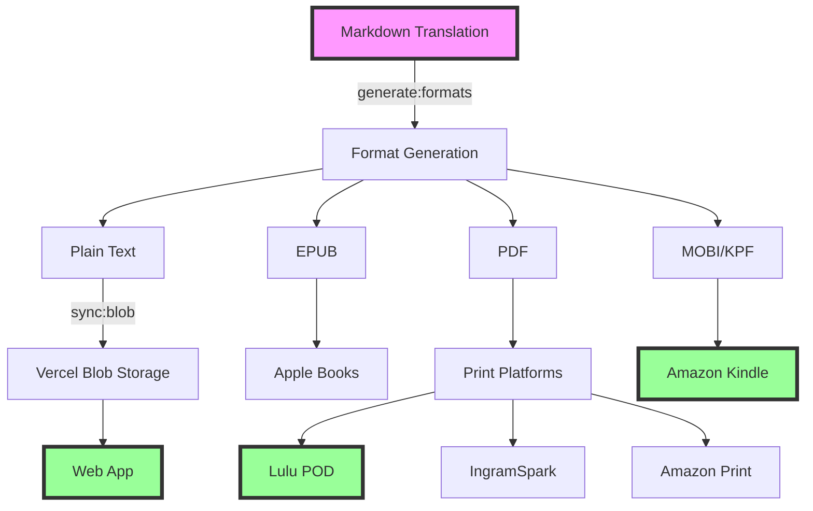

# Publishing Pipeline Documentation

## Overview

The Brainrot Publishing House uses a sophisticated multi-platform publishing pipeline that takes Gen Z translations from markdown source files to published books across web, ebook, and print platforms.



## Pipeline Stages

### 1. Content Creation
**Location**: `content/translations/books/[book-slug]/`

Each book contains:
- `brainrot/` - Chapter markdown files with Gen Z translations
- `metadata.yaml` - Publishing metadata (ISBN, pricing, categories)
- `source.txt` - Original public domain text (reference only)

### 2. Format Generation
**Command**: `pnpm generate:formats [book-slug]`
**Package**: `@brainrot/converter`

Converts markdown to multiple formats:
- **Text** (`.txt`) - For web reading
- **EPUB** (`.epub`) - For e-readers
- **PDF** (`.pdf`) - For print (paperback/hardcover variants)
- **MOBI/KPF** (`.mobi`) - For Kindle

Output location: `content/translations/books/[book-slug]/generated/`

### 3. Web Distribution
**Command**: `pnpm sync:blob [book-slug]`
**Automation**: Fully Automated

Process:
1. Text files uploaded to Vercel Blob Storage
2. Available at: `https://82qos1wlxbd4iq1g.public.blob.vercel-storage.com/books/[slug]/text/[filename]`
3. Web app fetches content on-demand
4. Deployed automatically via Vercel on push to main

### 4. Print Publishing

#### Amazon KDP (Kindle Direct Publishing)
**Command**: `pnpm publisher kdp publish [book-slug]`
**Automation**: Semi-Automated (Playwright)
**Formats**: Kindle eBook, Paperback

Process:
1. Browser automation with Playwright
2. Handles 2FA authentication
3. Uploads manuscript and cover
4. Sets pricing and territories
5. Can save as draft or publish directly

Credentials required:
- `KDP_EMAIL`
- `KDP_PASSWORD`

#### Lulu Print-on-Demand
**Command**: `pnpm publisher lulu publish [book-slug]`
**Automation**: Fully Automated (API)
**Formats**: Paperback, Hardcover

Process:
1. OAuth2 authentication
2. Creates project via API
3. Uploads interior PDF
4. Uploads cover PDF
5. Sets global pricing
6. Publishes to Lulu marketplace

Credentials required:
- `LULU_API_KEY`
- `LULU_API_SECRET`

#### IngramSpark
**Status**: Manual Process
**Formats**: Paperback, Hardcover

Process:
1. Export print-ready PDF from generated files
2. Manual upload via IngramSpark dashboard
3. Manual metadata entry
4. Manual pricing configuration

### 5. Unified Publishing
**Command**: `pnpm publisher publish-all [book-slug]`

Publishes to all configured platforms:
1. Pre-flight checks (file validation, metadata completeness)
2. Sequential platform publishing
3. Generates consolidated report
4. Saves to `publishing-reports/[date]-[book].json`

## Platform Comparison

| Platform | Automation | Formats | Distribution | Royalties | Setup Time |
|----------|------------|---------|--------------|-----------|------------|
| Web (Vercel) | Full | Text | Global | N/A | Instant |
| Amazon KDP | Semi | eBook, Print | Global | 35-70% | 24-72h |
| Lulu | Full | Print | Global | Variable | 24-48h |
| IngramSpark | Manual | Print | Bookstores | 35-45% | 1-2 weeks |
| Apple Books | Planned | eBook | Global | 70% | TBD |
| Google Play | Planned | eBook | Global | 70% | TBD |

## Automation Scripts

### Generate All Formats
```bash
# Single book
pnpm generate:formats great-gatsby

# All books
pnpm generate:formats --all

# With verbose output
pnpm generate:formats great-gatsby --verbose

# Dry run (no file generation)
pnpm generate:formats great-gatsby --dry-run
```

### Sync to Blob Storage
```bash
# Single book
pnpm sync:blob great-gatsby

# All books
pnpm sync:blob --all

# Force re-upload (ignore checksums)
pnpm sync:blob great-gatsby --force

# Delete orphaned files
pnpm sync:blob great-gatsby --delete
```

### Publisher CLI
```bash
# List available books
pnpm publisher list

# Validate book before publishing
pnpm publisher validate great-gatsby

# Publish to specific platform
pnpm publisher kdp publish great-gatsby
pnpm publisher lulu publish great-gatsby

# Publish to all platforms
pnpm publisher publish-all great-gatsby

# Dry run mode
pnpm publisher publish-all great-gatsby --dry-run

# Mock mode (no real API calls)
pnpm publisher publish-all great-gatsby --mock
```

## CI/CD Integration

### GitHub Actions Workflows

#### Content Sync (Daily)
**File**: `.github/workflows/sync-content.yml`
**Schedule**: Daily at 5 AM UTC
**Action**: Syncs all book content to blob storage

#### Book Publishing (On Change)
**File**: `.github/workflows/publish-books.yml`
**Trigger**: Changes to `content/translations/books/**`
**Action**: Generates formats and uploads to blob storage

#### Web Deployment (On Push)
**File**: `.github/workflows/deploy-web.yml`
**Trigger**: Push to main branch, changes in `apps/web/**`
**Action**: Deploys web app to Vercel

## Publishing Checklist

### Pre-Publishing
- [ ] Translation complete and reviewed
- [ ] Metadata.yaml created with ISBNs
- [ ] Cover design ready (if applicable)
- [ ] Categories and keywords selected
- [ ] Pricing strategy determined

### Format Generation
- [ ] Run `pnpm generate:formats [book]`
- [ ] Verify text files generated
- [ ] Check EPUB validity (if using)
- [ ] Review PDF formatting
- [ ] Test Kindle preview

### Platform Publishing
- [ ] Sync to blob storage for web
- [ ] Publish to KDP (Kindle + Print)
- [ ] Publish to Lulu (POD)
- [ ] Submit to IngramSpark (manual)
- [ ] Update tracking spreadsheet

### Post-Publishing
- [ ] Verify live on all platforms
- [ ] Test purchase flow
- [ ] Update marketing materials
- [ ] Share on social media
- [ ] Monitor initial sales/feedback

## Metadata Requirements

### Required Fields
```yaml
title: "The Great Gatsby but it's Gen Z"
author: "F. Scott Fitzgerald"
translator: "Brainrot Classics"
description: "The classic American novel reimagined..."
language: "en"
publishDate: "2024-01-01"
```

### ISBN Assignment
```yaml
isbn:
  ebook: "979-8-88888-001-1"    # Kindle/EPUB
  paperback: "979-8-88888-001-2" # Print on Demand
  hardcover: "979-8-88888-001-3" # Premium Edition
```

### Pricing Structure
```yaml
pricing:
  ebook: 4.99      # Standard ebook price
  paperback: 14.99 # POD paperback
  hardcover: 24.99 # Premium hardcover
```

### Platform Configuration
```yaml
platforms:
  kdp: true        # Amazon publishing
  lulu: true       # Lulu marketplace
  ingram: false    # Manual process
  d2d: false       # Future platform
```

## Troubleshooting

### Common Issues

#### Format Generation Fails
- Check pandoc installation: `pandoc --version`
- Verify markdown syntax in source files
- Check metadata.yaml is valid YAML
- Review error logs in console output

#### Blob Storage Sync Errors
- Verify `BLOB_READ_WRITE_TOKEN` is set
- Check network connectivity
- Review `sync-log.json` for details
- Use `--force` flag to override checksums

#### KDP Publishing Blocked
- Check 2FA is properly configured
- Verify KDP account is in good standing
- Review screenshot captures for errors
- Try headed mode: `--headed`

#### Lulu API Errors
- Verify API credentials are valid
- Check OAuth token hasn't expired
- Review API response in verbose mode
- Use mock mode for testing

### Debug Commands

```bash
# Test with verbose output
pnpm publisher publish-all great-gatsby --verbose

# Run in headed mode (see browser)
pnpm publisher kdp publish great-gatsby --headed

# Use mock mode (no real API calls)
pnpm publisher publish-all great-gatsby --mock

# Check configuration
pnpm publisher validate great-gatsby
```

## Security Considerations

### Credential Management
- Never commit credentials to repository
- Use dotenv-vault for secret sharing
- Rotate API keys monthly
- Use 2FA where available

### File Validation
- Validate all uploaded files
- Check file sizes before upload
- Verify checksums for integrity
- Scan for malicious content

### API Rate Limiting
- Respect platform rate limits
- Implement exponential backoff
- Cache API responses
- Monitor usage with `pnpm monitor`

## Future Enhancements

### Planned Features
- Apple Books integration (iBooks Author)
- Google Play Books support
- Audiobook generation with AI voices
- Translation quality scoring
- A/B testing for covers/descriptions
- Sales analytics dashboard
- Automated marketing campaigns

### Platform Expansion
- Barnes & Noble Press
- Kobo Writing Life
- Draft2Digital aggregation
- Smashwords distribution
- BookBaby services

### Automation Improvements
- Parallel platform publishing
- Automatic cover generation
- AI-powered description writing
- Dynamic pricing optimization
- Review monitoring and response

## Support Resources

### Documentation
- [Vercel Blob Storage](https://vercel.com/docs/storage/vercel-blob)
- [Amazon KDP Guidelines](https://kdp.amazon.com)
- [Lulu API Documentation](https://developers.lulu.com)
- [IngramSpark File Creation](https://www.ingramspark.com/plan/tools)

### Tools
- [Pandoc](https://pandoc.org) - Document conversion
- [Calibre](https://calibre-ebook.com) - eBook management
- [Playwright](https://playwright.dev) - Browser automation
- [Commander.js](https://github.com/tj/commander.js) - CLI framework

### Community
- Project Issues: [GitHub Issues](https://github.com/phrazzld/brainrot/issues)
- Discord: #publishing channel
- Email: publishing@brainrot.pub

## Quick Reference Card

```bash
# Complete publishing workflow for a new book
pnpm generate:formats great-gatsby        # Generate all formats
pnpm sync:blob great-gatsby              # Upload to web
pnpm publisher validate great-gatsby     # Pre-flight checks
pnpm publisher publish-all great-gatsby  # Publish everywhere

# Check status
pnpm publisher list                      # List all books
pnpm monitor                            # API usage stats
cat sync-log.json | jq                  # View sync history
ls publishing-reports/                  # Publishing history
```

---

*Last Updated: 2025-08-19*
*Version: 1.0.0*